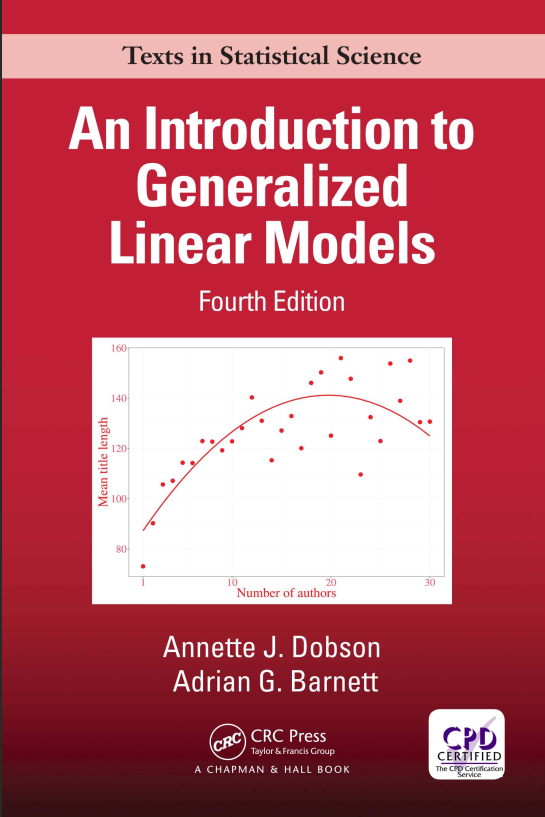
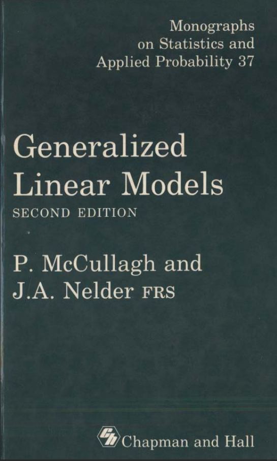

## Canais de Comunicação e Materiais da Disciplina

- Site: <http://sadraquelucena.github.io/mlg>

- Grupo no WhatsApp: <http://tiny.cc/mlg262>

{fig-align="center"}


## Informações da disciplina

- **Componente curricular:** ESTAT0092 -- Modelos Lineares Generalizados
- **Período:** 6º semestre
- **Carga horária:** 60 horas (4 créditos)
- **Horário:**
  - Quartas - 20h45 às 22h15
  - Sextas - 19h00 às 20h30
- **Docente:** Prof. Dr. Sadraque E. F. Lucena


## Objetivo da Disciplina

- **Compreender** as limitações do Modelo Linear Clássico;
- **Dominar** a estrutura teórica da Família Exponencial de distribuições;
- **Estimar** parâmetros via Máxima Verossimilhança e Algoritmo IWLS;
- **Interpretar** coeficientes em diferentes escalas (Logit, Log, Identidade, etc.);
- **Avaliar** a qualidade do ajuste utilizando a *Deviance* e resíduos apropriados;
- **Aplicar** MLGs em problemas reais com dados biológicos, econômicos e sociais, entre outros.


## Ementa

- Família exponencial de distribuições.
- Ajuste de modelos.
- Função de ligação.
- Modelos lineares generalizados especiais.
- Estimação.
- A função desvio.
- Testes de hipóteses.
- Análise de dados reais.
- Análise dos resíduos.
- Técnicas de diagnóstico.


## Conteúdo Programático

### Parte 1. Família Exponencial de Distribuições<br>
*A base probabilística dos MLGs*

- Definição e forma canônica
- Média, variância e função de variância
- Propriedades teóricas
- Principais membros: Normal, Binomial, Poisson, Gama, Inversa Normal


## Conteúdo Programático

### Parte 2. Estrutura e Estimação nos MLGs<br>
*A mecânica da modelagem generalizada*

- Componente aleatório, componente sistemático e função de ligação
- Ligações canônicas vs. não canônicas
- Função de verossimilhança e equações de estimação
- O Algoritmo IWLS (*Iteratively Reweighted Least Squares*)


## Conteúdo Programático

### Parte 3. Diagnóstico e Avaliação de Ajuste<br>
*Como saber se o MLG é adequado?*

- Conceito de Modelo Saturado e *Deviance*
- Testes de Razão de Verossimilhança (LRT) e Análise de Deviance (ANODEV)
- Resíduos em MLG: Pearson, Deviance e Quantílicos
- Alavancagem e pontos influentes em MLG


## Conteúdo Programático

### Parte 4. Aplicações Principais<br>
*Modelos para dados reais*

- Regressão Logística (respostas binárias e proporções)
- Regressão de Poisson e Binomial Negativa (dados de contagem e superdispersão)
- Modelos Gama e Log-Normal (dados contínuos assimétricos positivos)
- Tópicos avançados e seleção de modelos (AIC/BIC)


## Avaliação

- Serão realizadas avaliações contínuas.
- A aprovação requer uma média maior ou igual a 5,0.


## Datas Importantes

::: {.callout-important title="Não haverá aula:"}

- **28/Out/2026:** Dia do Servidor Público (recesso acadêmico)
- **20/Nov/2026:** Dia Nacional de Zumbi e da Consciência Negra (feriado
nacional)
- **25 e 27/Nov/25:** XII SEMAC
:::


## Bibliografia Recomendada

::: {.columns}
::: {.column width="33%"}
{height=13cm}
:::
::: {.column width="33%"}
{height=13cm}
:::
::: {.column width="33%"}
{height=13cm}
:::
:::


# Regressão Linear


## O Modelo Normal Linear

$$Y_i = \beta_0 + \beta_1 X_{i1} + \cdots + \beta_p X_{ip} + \varepsilon_i, \quad i=1, \dots, n$$

em que:

- **Componente Aleatório:** $\varepsilon_i \sim N(0, \sigma^2)$ independentes
- **Média Condicional:** $E(Y_i | X_i) = \mu_i = \beta_0 + \beta_1 X_{i1} + \cdots + \beta_p X_{ip}$
- **Homocedasticidade:** $\text{Var}(\varepsilon_i) = \text{Var}(Y_i | X_i) = \sigma^2$ (constante)
- **Distribuição da Resposta:** $Y_i | X_i \sim N(\mu_i, \sigma^2)$

> **No MLG:** Esta estrutura será flexibilizada. $Y_i$ poderá seguir outras distribuições (Binomial, Poisson, Gama) e a média $\mu_i$ será conectada ao preditor linear por uma *função de ligação* $g(\mu_i)$.


## Modelo Explicativo ou Preditivo?

::::{.columns}

:::{.column width="50%"}

#### Modelo Explicativo

- Interesse nos efeitos causais/associativos das covariáveis;
- Interpretação direta dos coeficientes ($\beta$);
- Foco em inferência, testes de hipóteses e ICs;
- Fortemente embasado na teoria do problema.

:::

:::{.column width="50%"}

#### Modelo Preditivo

- Interesse em prever o valor de novas observações ($Y_{novo}$);
- Foco na capacidade de generalização fora da amostra;
- Validação cruzada e erro quadrático médio de previsão;
- Pode sacrificar a interpretabilidade em favor da acurácia.
:::

::::

**Atenção:** Os critérios de seleção e avaliação dependem do objetivo! Um modelo com alto $R^2$ pode ter péssimo desempenho preditivo por *overfitting*.


## Antes do Modelo: Conheça os Dados

- A análise estatística rigorosa começa na preparação e limpeza da base.
- **Checklist essencial:**
  - Qual é a variável resposta? Qual é o seu suporte (contínua, contagem, binária)?
  - Qual é a unidade observacional?
  - Quais são as variáveis explicativas e seus tipos?
  - Existem variáveis categóricas (necessidade de codificação em *dummies*)?
  - Existem valores impossíveis, erros de digitação ou duplicações?
  - Existem valores extremos (*outliers*) nas covariáveis e na resposta?
  - Qual o padrão de valores ausentes (*missing values*)?


## Tipos de Variáveis e Tratamento de `NA`

#### Variáveis Categóricas
- Garantir que estejam codificadas como `factor` no R.
- O R criará automaticamente $k-1$ variáveis *dummy* para um fator com $k$ níveis, assumindo o primeiro nível como **categoria de referência**.

#### Valores Ausentes (`NA`)
- Avaliar o percentual e o mecanismo de ausência.
- **Abordagens:**
  - *Análise de casos completos:* Ok para baixo % de ausências aleatórias.
  - *Imputação simples:* Média/mediana (distorce a variância).
  - *Imputação múltipla (ex: pacote MICE):* Recomendada quando há padrão de ausência moderado.


## Ajuste do Modelo via Mínimos Quadrados e Verossimilhança

Em forma matricial:
$$ Y = X\beta + \varepsilon, \quad \varepsilon \sim N(0, \sigma^2 I_n) $$

1. **Mínimos Quadrados Ordinários (MQO):**
   Minimiza a Soma de Quadrados dos Resíduos $SQR(\beta) = (Y - X\beta)^\top (Y - X\beta)$, resultando em:
   $$\widehat{\beta} = (X^\top X)^{-1} X^\top Y$$

2. **Máxima Verossimilhança (EMV):**
   Sob a suposição de Normalidade, o EMV para $\beta$ é **exatamente idêntico** ao estimador de MQO.


## Da Soma de Quadrados ao Conceito de Desvio

- A qualidade do ajuste no modelo normal é mensurada pela **Soma de Quadrados dos Resíduos (SQR)**:
  $$SQR = \sum_{i=1}^n (y_i - \widehat{y}_i)^2$$

- **Estimador da Variância dos Erros ($\sigma^2$):** 
  $$\widehat{\sigma}^2 = \frac{SQR}{n - p - 1}$$

> Nos MLGs, a $SQR$ é generalizada pelo conceito de **Desvio (*Deviance*)**, medida baseada na verossimilhança que compara o modelo ajustado ao *modelo saturado*.


## Matriz de Covariância dos Estimadores e Erros-Padrão

- Como $\widehat{\beta} = (X^\top X)^{-1} X^\top Y$ é uma combinação linear de $Y$, sua matriz de variância-covariância é dada por:
  $$\text{Var}(\widehat{\beta}) = \sigma^2 (X^\top X)^{-1}$$

- O **erro-padrão** do coeficiente $\widehat{\beta}_j$, denotado por $SE(\widehat{\beta}_j)$, é a raiz quadrada do $j$-ésimo elemento da diagonal de $\widehat{\sigma}^2 (X^\top X)^{-1}$.

- **Teste $t$ de Wald para significância individual:**
  $$H_0: \beta_j = 0 \quad \text{vs} \quad H_1: \beta_j \neq 0 \implies t_j = \frac{\widehat{\beta}_j}{SE(\widehat{\beta}_j)} \sim t_{n-p-1}$$


## Avaliação Global do Modelo

| Medida | Fórmula / Definição | Pergunta / Interpretação |
| :--- | :--- | :------- |
| **$R^2$** | $1 - \frac{SQR}{SQT}$ | Quanto da variabilidade observada de $Y$ é explicada pelas covariáveis? |
| **$R^2_{ajustado}$** | $1 - \left[\frac{(1-R^2)(n-1)}{n-p-1}\right]$ | O ganho de explicação compensa a penalização pelo número de parâmetros? |
| **Teste $F$ Global** | $\frac{SQE / p}{SQR / (n - p - 1)}$ | O conjunto de regressores melhora o ajuste em relação ao modelo apenas com intercepto? |


## Avaliação Global do Modelo

| Medida | Fórmula / Definição | Pergunta / Interpretação |
| :--- | :--- | :------- |
| **AIC** | $2k - 2\ln(\widehat{L})$ | Qual modelo oferece melhor compromisso entre ajuste e complexidade? |
| **BIC** | $k\ln(n) - 2\ln(\widehat{L})$ | Qual modelo é preferível quando aplicamos penalização mais severa para amostras grandes? |


## Comparação de Modelos Aninhados: O Teste F

Para comparar um **Modelo Reduzido ($R$)** com $g$ parâmetros contra um **Modelo Completo ($F$)** com $p$ parâmetros ($p > g$, com $q = p - g$ restrições):

$$H_0: \beta_{g+1} = \dots = \beta_p = 0$$

- Calculamos a estatística $F$ parcial:
  $$F = \frac{(SQR_R - SQR_F) / q}{SQR_F / (n - p - 1)} \sim F_{q, \, n-p-1}$$

> **Conexão com MLG:** Nos MLGs, a comparação de modelos aninhados é feita de forma análoga substituindo o Teste $F$ pelo **Teste de Razão de Verossimilhança (LRT)** baseado na diferença de *Deviances*.


## Interpretação Prática dos Coeficientes ($\beta$)

#### 1. Variável Contínua ($X_j$)
- Mantendo as demais variáveis constantes, o aumento de 1 unidade em $X_j$ está associado a uma variação média de $\widehat{\beta}_j$ unidades em $Y$.

#### 2. Variável Categórica (Dummies)
- Se $X_{\text{sul}} = 1$ e a referência é o Norte: $\widehat{\beta}_{\text{sul}}$ é a **diferença média** na resposta $Y$ do grupo Sul em relação ao grupo Norte.

#### 3. Variável de Interação ($X_1 \cdot X_2$)
- O efeito marginal de $X_1$ sobre $Y$ depende do nível de $X_2$:
  $$\frac{\partial Y}{\partial X_1} = \widehat{\beta}_1 + \widehat{\beta}_{12} X_2$$


## Interpretação em Escala Logarítmica

Quando aplicamos a transformação $\ln(Y) = \beta_0 + \beta_1 X_1 + \varepsilon$:

$$\widehat{Y} = e^{\widehat{\beta}_0 + \widehat{\beta}_1 X_1}$$

- O coeficiente $\widehat{\beta}_1$ representa uma **variação multiplicativa (percentual)** na escala original de $Y$:
  $$\text{Variação }\%\text{ em } Y \approx 100 \times \widehat{\beta}_1 \% \quad (\text{ou exata: } 100 \times (e^{\widehat{\beta}_1} - 1)\%)$$

> **Conexão com MLG:** Esta é a exata mecânica da **função de ligação logaritmo** ($\ln(\mu) = X\beta$) empregada nas Regressões de Poisson e Gama!


## Incerteza da Estimação: IC da Média vs. IP Individual

Ao realizar predições para um novo perfil de covariáveis $x_0$, há duas perguntas diferentes:

|               | **Média**                               | **Observação individual**                         |
| ------------- | --------------------------------------- | ------------------------------------------------- |
| **Pergunta**  | Qual é a média de (Y) para esse perfil? | Qual será o valor de uma nova observação?         |
| **Intervalo** | Intervalo de confiança                  | Intervalo de predição                             |
| **Incerteza** | Incerteza na estimação da média         | Incerteza da média **+** variabilidade individual |
| **Variância** | $\sigma^2 \cdot x_0^\top (X^\top X)^{-1} x_0 = \sigma^2 \cdot h_{00}$                        | $\sigma^2 \cdot (1 + h_{00})$                              |
| **Largura**   | Mais estreito                           | Mais amplo                                    |


## Seleção de Variáveis: Abordagem Clássica

- Procedimento interativo de construção de modelos:
  1. Avaliar significância individual e global;
  2. Testar remoção de regressores não significativos via Teste $F$ parcial;
  3. Reajustar e reavaliar diagnósticos.

- **Métodos Automáticos:**
  - *Backward*, *Forward*, *Stepwise* (via `stepAIC()` no R).

<br>

**Alerta Metodológico:** A seleção automática não substitui o conhecimento teórico do problema. Variáveis de controle de grande relevância teórica devem ser mantidas no modelo mesmo que o $p$-valor não seja significante.


## Diagnóstico: Por que Analisar os Resíduos?

- Os resíduos ordinários são definidos por:
  $$e_i = Y_i - \widehat{Y}_i$$

- As suposições fundamentais do Modelo Normal Linear são:
  1. **Linearidade e Erro Nulo:** $E(\varepsilon_i) = 0$
  2. **Homocedasticidade:** $\text{Var}(\varepsilon_i) = \sigma^2$
  3. **Independência:** $\text{Cov}(\varepsilon_i, \varepsilon_j) = 0, \quad \forall i \neq j$
  4. **Normalidade:** $\varepsilon_i \sim N(0, \sigma^2)$

- A análise de resíduos é a principal ferramenta para checar se tais hipóteses são plausíveis na prática.


## Diagnóstico 1: Resíduos × Valores Ajustados (*Residuals vs Fitted*)

Gráfico $e_i$ versus $\widehat{Y}_i$. Usado para verificar linearidade e homocedasticidade.

- **O que esperar:** Dispersão aleatória em torno do zero, sem padrão discernível e com amplitude constante.

- **Problemas e Sintomas:**
  - *Formato de funil:* Heterocedasticidade (variância cresce/diminui com a média).
  - *Formato de U ou curvatura:* Não linearidade (falta de termos quadráticos ou interações).
  - *Agrupamentos isolados:* Estrutura não modelada (variável categórica omitida).


## Diagnóstico 1: Resíduos × Valores Ajustados (*Residuals vs Fitted*)

```{r}
#| label: fig-residuos-fitted-diagnostico
#| fig-width: 10
#| fig-height: 7
#| warning: false
#| message: false

library(ggplot2)
library(dplyr)
library(patchwork)

set.seed(123)

n <- 300
x <- seq(1, 100, length.out = n)

# ---------------------------------------------------------
# 1. Situação adequada: dispersão aleatória e homocedástica
# ---------------------------------------------------------

dados_1 <- tibble(
  fitted = x,
  residual = rnorm(n, 0, 8)
)

p1 <- ggplot(dados_1, aes(fitted, residual)) +
  geom_hline(yintercept = 0, linewidth = 0.5) +
  geom_point(alpha = 0.55, size = 1.8) +
  labs(
    title = "1. Adequado",
    subtitle = "Dispersao aleatoria e amplitude constante",
    x = expression(hat(Y)[i]),
    y = "Residuo"
  ) +
  coord_cartesian(ylim = c(-30, 30)) +
  theme_minimal(base_size = 13)


# ---------------------------------------------------------
# 2. Funil: heterocedasticidade
# ---------------------------------------------------------

dados_2 <- tibble(
  fitted = x,
  residual = rnorm(n, 0, 2 + 0.10 * x)
)

p2 <- ggplot(dados_2, aes(fitted, residual)) +
  geom_hline(yintercept = 0, linewidth = 0.5) +
  geom_point(alpha = 0.55, size = 1.8) +
  labs(
    title = "2. Funil",
    subtitle = "Heterocedasticidade",
    x = expression(hat(Y)[i]),
    y = "Residuo"
  ) +
  coord_cartesian(ylim = c(-30, 30)) +
  theme_minimal(base_size = 13)


# ---------------------------------------------------------
# 3. Curvatura: não linearidade
# ---------------------------------------------------------

dados_3 <- tibble(
  fitted = x,
  residual = 0.006 * (x - 50)^2 - 8 + rnorm(n, 0, 5)
)

p3 <- ggplot(dados_3, aes(fitted, residual)) +
  geom_hline(yintercept = 0, linewidth = 0.5) +
  geom_point(alpha = 0.55, size = 1.8) +
  geom_smooth(
    method = "loess",
    se = FALSE,
    linewidth = 1
  ) +
  labs(
    title = "3. Curvatura",
    subtitle = "Possivel nao linearidade",
    x = expression(hat(Y)[i]),
    y = "Residuo"
  ) +
  coord_cartesian(ylim = c(-30, 30)) +
  theme_minimal(base_size = 13)


# ---------------------------------------------------------
# 4. Agrupamentos: estrutura não modelada
# ---------------------------------------------------------

dados_4 <- tibble(
  fitted = x,
  grupo = rep(c("A", "B", "C"), each = n / 3),
  residual = rep(c(-12, 0, 12), each = n / 3) +
    rnorm(n, 0, 4)
)

p4 <- ggplot(dados_4, aes(fitted, residual)) +
  geom_hline(yintercept = 0, linewidth = 0.5) +
  geom_point(alpha = 0.55, size = 1.8) +
  labs(
    title = "4. Agrupamentos",
    subtitle = "Possivel estrutura nao modelada",
    x = expression(hat(Y)[i]),
    y = "Residuo"
  ) +
  coord_cartesian(ylim = c(-30, 30)) +
  theme_minimal(base_size = 13)


# ---------------------------------------------------------
# Figura final: quatro quadrantes
# ---------------------------------------------------------

(p1 + p2) / (p3 + p4)
```


## Diagnóstico 1: Resíduos × Valores Ajustados (*Residuals vs Fitted*)

#### Possíveis Soluções para Inadequações:

- Transformação da variável resposta $Y$ (ex: $\sqrt{Y}$, $\ln(Y)$);
- Transformação de covariáveis ou inclusão de termos de ordem superior ($X^2$);
- Inclusão de termos de interação ($X_1 \cdot X_2$);
- Modelagem explícita da variância (Mínimos Quadrados Ponderados);
- **Migração para MLG** (ex: se a variância cresce com a média, a distribuição de Poisson ou Gama é mais adequada).


## Diagnóstico 2: Q-Q Plot Normal

Gráfico dos quantis amostrais dos resíduos padronizados versus os quantis teóricos da distribuição Normal padrão.

- **O que esperar:** Pontos dispostos perfeitamente sobre a reta de referência de 45 graus.

- **Problemas Detectados:**
  - *Fugas nas pontas (caudas pesadas/leves):* Presença de *outliers* ou distribuição com caudas mais densas que a Normal.
  - *Formato em S (assimetria):* Resíduos com distribuição assimétrica positiva ou negativa.


## Diagnóstico 2: Q-Q Plot Normal

```{r}
#| label: fig-qq-diagnostico
#| fig-width: 10
#| fig-height: 7
#| warning: false
#| message: false

library(ggplot2)
library(patchwork)

set.seed(123)

n <- 300

# ---------------------------------------------------------
# Função para criar Q-Q plots simulados
# ---------------------------------------------------------

dados_qq <- function(residuos) {
  qqnorm_data <- qqnorm(residuos, plot.it = FALSE)

  tibble(
    teorico = qqnorm_data$x,
    amostral = qqnorm_data$y
  )
}


# ---------------------------------------------------------
# 1. Normalidade adequada
# ---------------------------------------------------------

residuos_1 <- rnorm(n)

dados_1 <- dados_qq(residuos_1)

p1 <- ggplot(dados_1, aes(teorico, amostral)) +
  geom_abline(
    intercept = 0,
    slope = 1,
    linewidth = 0.8
  ) +
  geom_point(
    alpha = 0.55,
    size = 1.8
  ) +
  labs(
    title = "1. Adequado",
    subtitle = "Residuos aproximadamente normais",
    x = "Quantis teoricos",
    y = "Quantis amostrais"
  ) +
  theme_minimal(base_size = 13)


# ---------------------------------------------------------
# 2. Caudas pesadas
# ---------------------------------------------------------

residuos_2 <- rt(n, df = 3)

dados_2 <- dados_qq(residuos_2)

p2 <- ggplot(dados_2, aes(teorico, amostral)) +
  geom_abline(
    intercept = 0,
    slope = 1,
    linewidth = 0.8
  ) +
  geom_point(
    alpha = 0.55,
    size = 1.8
  ) +
  labs(
    title = "2. Caudas pesadas",
    subtitle = "Desvios nas extremidades",
    x = "Quantis teoricos",
    y = "Quantis amostrais"
  ) +
  theme_minimal(base_size = 13)


# ---------------------------------------------------------
# 3. Assimetria
# ---------------------------------------------------------

residuos_3 <- rlnorm(n, meanlog = 0, sdlog = 0.6)
residuos_3 <- residuos_3 - mean(residuos_3)

dados_3 <- dados_qq(residuos_3)

p3 <- ggplot(dados_3, aes(teorico, amostral)) +
  geom_abline(
    intercept = 0,
    slope = 1,
    linewidth = 0.8
  ) +
  geom_point(
    alpha = 0.55,
    size = 1.8
  ) +
  labs(
    title = "3. Assimetria",
    subtitle = "Desvio sistematico da reta",
    x = "Quantis teoricos",
    y = "Quantis amostrais"
  ) +
  theme_minimal(base_size = 13)


# ---------------------------------------------------------
# Figura final: três situações
# ---------------------------------------------------------

(p1 | p2) / p3
```


## Diagnóstico 2: Q-Q Plot Normal

#### Implicações e Soluções:

- Checar erros de digitação na base de dados;
- Avaliar a necessidade de transformação de $Y$;
- Testar modelos alternativos apropriados para dados assimétricos;
- **Lembrar:** O Teorema Central do Limite garante a consistência assintótica das estimativas em amostras grandes, mas a inferência exata em amostras pequenas depende criticamente da Normalidade.


## Diagnóstico 3: Scale-Location

Gráfico da raiz quadrada dos resíduos padronizados $\sqrt{|r_i^*|}$ versus os valores ajustados $\widehat{Y}_i$.

- **Objetivo principal:** Avaliar a suposição de homocedasticidade de forma mais clara do que o gráfico clássico de resíduos.

- **O que esperar:** Linha suave (*lowess*) aproximadamente horizontal, com pontos espalhados aleatoriamente ao seu redor.

- **Sintoma de Violação:** Linha com inclinação acentuada indicando variação sistemática na dispersão do erro ao longo dos valores preditos.

- **Possíveis soluções:** As mesmas do Dignóstico 1.


## Diagnóstico 3: Scale-Location

```{r}
#| label: fig-scale-location-diagnostico
#| fig-width: 10
#| fig-height: 7
#| warning: false
#| message: false

library(ggplot2)
library(patchwork)

set.seed(123)

n <- 300
fitted <- seq(1, 100, length.out = n)


# ---------------------------------------------------------
# 1. Homocedasticidade
# ---------------------------------------------------------

residuos_1 <- rnorm(n, 0, 1)

dados_1 <- data.frame(
  fitted = fitted,
  scale = sqrt(abs(residuos_1))
)

p1 <- ggplot(dados_1, aes(fitted, scale)) +
  geom_point(alpha = 0.55, size = 1.8) +
  geom_smooth(
    method = "loess",
    se = FALSE,
    linewidth = 1
  ) +
  labs(
    title = "1. Adequado",
    subtitle = "Dispersao aproximadamente constante",
    x = expression(hat(Y)[i]),
    y = expression(sqrt("|" * r[i]^"*" * "|"))
  ) +
  coord_cartesian(ylim = c(0, 2.5)) +
  theme_minimal(base_size = 13)


# ---------------------------------------------------------
# 2. Variância crescente
# ---------------------------------------------------------

desvio_2 <- 0.15 + 0.018 * fitted

residuos_2 <- rnorm(
  n,
  mean = 0,
  sd = desvio_2
)

dados_2 <- data.frame(
  fitted = fitted,
  scale = sqrt(abs(residuos_2))
)

p2 <- ggplot(dados_2, aes(fitted, scale)) +
  geom_point(alpha = 0.55, size = 1.8) +
  geom_smooth(
    method = "loess",
    se = FALSE,
    linewidth = 1
  ) +
  labs(
    title = "2. Variancia crescente",
    subtitle = "Dispersao aumenta com os valores ajustados",
    x = expression(hat(Y)[i]),
    y = expression(sqrt("|" * r[i]^"*" * "|"))
  ) +
  coord_cartesian(ylim = c(0, 2.5)) +
  theme_minimal(base_size = 13)


# ---------------------------------------------------------
# 3. Variância decrescente
# ---------------------------------------------------------

desvio_3 <- 1.8 - 0.015 * fitted

residuos_3 <- rnorm(
  n,
  mean = 0,
  sd = pmax(desvio_3, 0.2)
)

dados_3 <- data.frame(
  fitted = fitted,
  scale = sqrt(abs(residuos_3))
)

p3 <- ggplot(dados_3, aes(fitted, scale)) +
  geom_point(alpha = 0.55, size = 1.8) +
  geom_smooth(
    method = "loess",
    se = FALSE,
    linewidth = 1
  ) +
  labs(
    title = "3. Variancia decrescente",
    subtitle = "Dispersao diminui com os valores ajustados",
    x = expression(hat(Y)[i]),
    y = expression(sqrt("|" * r[i]^"*" * "|"))
  ) +
  coord_cartesian(ylim = c(0, 2.5)) +
  theme_minimal(base_size = 13)


# ---------------------------------------------------------
# Figura final
# ---------------------------------------------------------

(p1 | p2) / p3
```


## Diagnóstico 4: Residuals vs Leverage e Matriz Chapéu ($H$)

Gráfico projetado para identificar pontos influentes que combinam alto *leverage* com resíduos elevados.

#### A Matriz Chapéu (*Hat Matrix* $H$)
A projeção que transforma observações em valores ajustados:
$$\widehat{Y} = X \widehat{\beta} = X(X^\top X)^{-1} X^\top Y = H Y$$

- Os elementos da diagonal principal $h_{ii} = H_{ii}$ são os valores de **alavancagem (*leverage*)**.
- Propriamente, $0 \le h_{ii} \le 1$ e $\sum h_{ii} = p + 1$.
- Avalia o quão distante a observação $i$ está do centro do espaço das covariáveis $X$.


## Alavancagem, Distância de Cook e Influência

#### Distância de Cook ($D_i$)
Avalia o impacto global no vetor de parâmetros $\widehat{\beta}$ caso a observação $i$ seja removida do ajuste:
$$D_i = \frac{r_i^{*2}}{p + 1} \left( \frac{h_{ii}}{1 - h_{ii}} \right)$$

onde $r_i^*$ é o resíduo studentizado.

- **Responde a Pergunta:** Quanto o ajuste do modelo mudaria sem essa observação?


## Alavancagem, Distância de Cook e Influência

#### Distância de Cook ($D_i$)

| Situação | Nível de Resíduo | Nível de Leverage ($h_{ii}$) | Diagnóstico / Ação |
| :--- | :--- | :--- | :--- |
| **Caso A** | Pequeno | Baixo | Observação típica e pouco preocupante |
| **Caso B** | Pequeno | Alto | Alto potencial de influência, mas ajusta-se bem |
| **Caso C** | Grande | Baixo | Possível *outlier* em $Y$ |
| **Caso D** | **Grande** | **Alto** | **Ponto Influente Crítico (Alta $D_i$)** |


## Gestão de Pontos Influentes

Quando identificar uma observação com alta Distância de Cook:

1. **Investigar a origem:**
   - Erro de digitação ou medição? $\rightarrow$ *Corrigir.*
   - Observação pertencente a outra população? $\rightarrow$ *Remover com justificativa.*
   - Observação legítima de um evento raro? $\rightarrow$ *NÃO remover sumariamente.*

2. **Regra de Ouro:**
   Nunca exclua um ponto de dados legítimo apenas porque ele é influente ou ajusta-se mal ao modelo Normal!


## Análise de Sensibilidade

Se o ponto influente for um dado legítimo, realize uma **Análise de Sensibilidade** (ajuste do modelo com e sem o ponto):

::::{.columns}

:::{.column width="50%"}
#### O que comparar:
- Alterações nos coeficientes $\widehat{\beta}$;
- Erros-padrão e alteração de significância estatística;
- Mudanças nos intervalos de confiança;
- Alterações nas predições e conclusões substantivas.
:::

:::{.column width="50%"}
#### Como reportar:
- Apresente o modelo principal ajustado com **todos os dados**;
- Apresente em tabela comparativa o modelo sem as observações influentes;
- **Conclusões inalteradas:** O resultado é robusto.
- **Conclusões alteradas:** O resultado é sensível, e essa limitação deve ser explicitada.
:::

::::


## Multicolinearidade e VIF

A multicolinearidade ocorre quando duas ou mais variáveis explicativas possuem forte correlação linear.

- **Consequência:** Inflação catastrófica das variâncias dos estimadores $\text{Var}(\widehat{\beta}_j)$, tornando os coeficientes instáveis e imprecisos.

- **Fator de Inflação da Variância (VIF):**
  $$VIF_j = \frac{1}{1 - R_j^2}$$
  onde $R_j^2$ é o coeficiente de determinação da regressão de $X_j$ contra todas as demais covariáveis.

- **Regra Prática:** $VIF_j > 5$ requer atenção; $VIF_j > 10$ indica multicolinearidade severa.


## Do Modelo Normal aos MLGs

No Modelo Linear Normal:
$$Y_i \sim N(\mu_i, \sigma^2), \qquad \mu_i = X_i \beta$$

Nos **Modelos Lineares Generalizados (MLG)**:
$$Y_i \sim \text{Distribuição da Família Exponencial}(\mu_i, \phi)$$
$$g(\mu_i) = X_i \beta$$

em que $g(\cdot)$ é uma **função de ligação** diferenciável e monótona.


## Do Modelo Normal aos MLGs

#### Exemplos de Estruturas de Modelagem:

| Tipo de Resposta $(Y)$ | Distribuição Típica | Função de Ligação Canônica | Equação do Modelo |
| :--- | :--- | :--- | :--- |
| **Contínua Simétrica** | Normal | Identidade | $\mu_i = X_i \beta$ |
| **Binária / Proporção** | Binomial | Logit | $\ln\left(\frac{\mu_i}{1-\mu_i}\right) = X_i \beta$ |
| **Contagem (Taxa)** | Poisson | Logaritmo | $\ln(\mu_i) = X_i \beta$ |
| **Contínua Assimétrica (+)** | Gama | Inversa | $\frac{1}{\mu_i} = X_i \beta$ |


## Projeto da Próxima Aula

#### Objetivo
Selecionar uma base de dados real e realizar uma análise completa e rigorosa aplicando o Modelo Normal Linear.

#### Requisitos Mínimos da Base de Dados
- Variável resposta quantitativa contínua;
- Pelo menos 3 variáveis explicativas;
- Pelo menos 1 variável categórica (fator);
- Tamanho amostral razoável ($n \ge 50$);
- **Dados reais** (não utilizar bases prontas didáticas como `mtcars` ou `iris`).


## Projeto da Próxima Aula

O relatório deverá conter as seções:

::::{.columns}
:::{.column width="50%"}
1. **Introdução e Descrição dos Dados:** Contexto e dicionário de variáveis.
2. **Análise Exploratória:** Distribuição da resposta e relações bivariadas.
3. **Especificação e Ajuste:** Formulação do modelo inicial.
4. **Seleção de Modelos:** Comparação via $R^2_{ajustado}$, Teste $F$ parcial e AIC/BIC.
:::

:::{.column width="50%"}
5. **Diagnóstico Completo:** Avaliação dos 4 gráficos clássicos de resíduos e VIF.
6. **Análise de Influência e Sensibilidade:** Verificação de pontos influentes via $D_i$.
7. **Interpretação do Modelo:** Discussão prática dos coeficientes e predições.
8. **Código Utilizado:** Apresentação do código usado paa análise dos dados.
:::
::::


# Fim