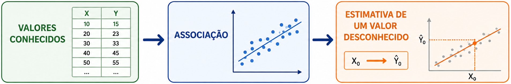
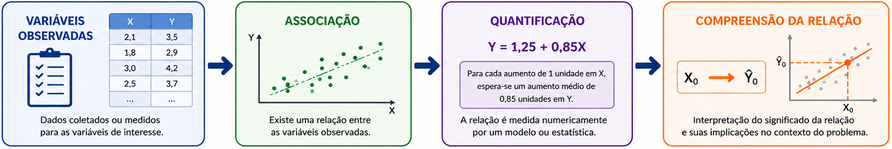

## Introdução

- A **Estatística** desenvolve e utiliza teorias, métodos matemáticos e probabilísticos e procedimentos computacionais para compreender o comportamento de fenômenos, objetos, indivíduos ou sistemas a partir de observações.

- Aquilo que se deseja compreender é denominado **entidade** (ex.: uma pessoa, uma empresa, uma cidade ou uma população)

- A entidade não é incorporada diretamente à análise estatística. Ela é   representada por características que podem ser observadas ou mensuradas (**variáveis**).

- Cada observação da entidade produz diferentes valores para suas variáveis e formam a **variabilidade**.

## Introdução

- A Estatística procura compreender essa variabilidade a partir da identificação de **padrões** no comportamento conjunto das observações.

- Os métodos estatísticos assumem que esses padrões possuem algum componente aleatório que pode ser estudado e representado probabilisticamente.

- Assim, embora não seja possível prever perfeitamente cada observação individual, é possível identificar regularidades e investigar **associações entre variáveis**.

- Por exemplo, podemos investigar como características de uma transação se relacionam com a probabilidade de fraude ou como características socioeconômicas de uma população se relacionam com seus indicadores de saúde.

## Introdução

- Uma vez identificada uma associação entre variáveis, podemos utilizá-la
para diferentes finalidades. Entre as mais importantes estão:
  - **Predizer** o valor de uma variável a partir de outras;
  - **Explicar** como uma variável varia em associação com outras.

## Predição

- Quando existe uma associação entre variáveis, os valores conhecidos de
  algumas delas podem ser utilizados para *estimar o valor desconhecido
  de outra*.

- Essa utilização da associação é denominada **predição**.

- A predição é particularmente útil quando a variável de interesse:
  - é difícil, cara ou demorada de ser observada; ou
  - representa um resultado que ainda será observado no futuro.

- **Exemplo:** uma empresa pode utilizar informações como *preço*, *período do ano*, *investimentos em publicidade* e *vendas anteriores* para *predizer a demanda de um produto no próximo mês*.

  

## Explicação

- A associação entre variáveis também pode ser utilizada para *descrever e quantificar como uma variável tende a variar em relação a outras*.

- Nesse caso, o objetivo não é necessariamente predizer o valor de uma nova observação, mas compreender e quantificar a relação observada entre as variáveis.

- **Exemplo:** podemos investigar como o *investimento em publicidade* está associado *às vendas* e estimar *quanto as vendas tendem a variar, em média, para diferentes níveis de investimento*.

- É importante destacar que **descrever uma associação não significa, necessariamente, demonstrar uma relação causal**.

  

## Modelagem de regressão

- A **modelagem de regressão** utiliza métodos estatísticos para estudar a associação entre duas ou mais variáveis e **representar matematicamente essa relação**.

- Uma variável é definida como a principal variável de interesse, denominada **variável resposta**, enquanto as demais são denominadas **variáveis preditoras** e são utilizadas para representar seu comportamento.

- Um **modelo de regressão** descreve como o comportamento da variável resposta está associado aos valores das variáveis preditoras, considerando a variabilidade presente nas observações.

- Esses modelos podem ser utilizados para **investigar associações**, **quantificar relações**, **descrever o comportamento** de uma variável ou **predizer valores desconhecidos**.

## Modelo de regressão normal linear

- Seja $Y$ a **variável resposta** e sejam $x_1, \ldots, x_p$ as **variáveis preditoras**.

- Para valores observados de $Y$ e das $x_1,\ldots,x_p$ das variáveis preditoras, o modelo de regressão normal linear assume que $$Y = \beta_0 + \beta_1 x_1 + \cdots + \beta_p x_p + \varepsilon$$

  - $\beta_0, \beta_1, \ldots, \beta_p$ são parâmetros reais;
  - $\varepsilon$ é uma variável aleatória tal que $\varepsilon\sim N(0, \sigma^2)$.

- Os coeficientes $\beta_0,\beta_1,\ldots,\beta_p$ e a variância $\sigma^2$ são os **parâmetros** do modelo.

- Em geral, os parâmetros são **desconhecidos** e devem ser estimados com base em uma amostra de observações da variável resposta e das variáveis preditoras.

- A variável aleatória $\varepsilon$ é denominada **erro aleatório**.

## Modelo de regressão normal linear

- O modelo de regressão normal linear possui as seguintes propriedades:

  1. $E[Y\mid x_1,\ldots,x_p] = \beta_0+\beta_1x_1+\cdots+\beta_px_p$;

  2. $Var[Y\mid x_1,\ldots,x_p]=\sigma^2$;

  3. $Y\mid x_1,\ldots,x_p$ segue uma distribuição normal.

- A primeira propriedade estabelece que a média da variável resposta
  varia linearmente em função das variáveis preditoras.

- A segunda estabelece que a variância da variável resposta permanece constante para diferentes valores das variáveis preditoras.

# Modelo de regressão normal linear

- Quando a variância condicional da variável resposta é constante, dizemos que há **homoscedasticidade**.

- O oposto de homoscedasticidade é a **heteroscedasticidade**, que ocorre quando a variância da variável resposta varia de acordo com os valores das variáveis preditoras.

- Essas propriedades permitem concluir que: $$Y\mid x_1,\ldots,x_p \sim N(\beta_0+\beta_1x_1+\cdots+\beta_px_p, \sigma^2).$$

- Ou seja, para determinados valores das variáveis preditoras, o modelo assume que a variável resposta segue uma distribuição Normal cuja **média é uma função linear das variáveis preditoras** e cuja **variância é constante**.

## Modelo de regressão normal linear

- O objetivo da modelagem de regressão é obter um modelo capaz de
  **descrever satisfatoriamente o comportamento da variável resposta**
  em função das variáveis preditoras.

- De forma geral, o processo envolve quatro etapas:

  1. **Especificação** do modelo;
  2. **Estimação** dos parâmetros;
  3. **Avaliação** da adequação do modelo;
  4. **Aplicação** do modelo.

- Inicialmente, definimos as variáveis, a estrutura do modelo e suas suposições.
- Em seguida, estimamos seus parâmetros a partir de uma amostra.

## Modelo de regressão normal linear

- Após estimar os parâmetros, avaliamos se o modelo descreve adequadamente os dados e se suas **suposições são plausíveis**.

- Também investigamos a existência de observações que não são adequadamente explicadas pelo modelo (análise de resíduos, identificação de pontos discrepantes, pontos de alavancagem e observações influentes).

- Uma vez considerado adequado, o modelo pode ser utilizado para:

  - **investigar associações**;
  - **descrever e quantificar relações**;
  - **predizer valores desconhecidos**.

- Espera-se, ao final do processo, obter um modelo capaz de reproduzir satisfatoriamente o comportamento observado da variável resposta.

## Modelo de regressão normal linear

- Na avaliação do modelo, investigamos se suas principais suposições são adequadas aos dados.

- No modelo de regressão normal linear, verificamos se:

  1. a média da resposta varia **linearmente** com as variáveis
     preditoras;

  2. a variância da resposta é **constante**;

  3. a resposta segue uma **distribuição Normal**, fixados os valores
     das variáveis preditoras.

- A violação de alguma dessas suposições pode indicar que o modelo normal linear não é adequado aos dados.

- Uma possibilidade para lidar com essas situações é transformar a variável resposta e/ou as variáveis preditoras (ex.: transformação de Box-Cox).

- Outra é **repensar a própria estrutura do modelo**.

## Uma nova forma de representar o modelo

- Temos que o modelo de regressão normal linear é geralmente escrito como: $$Y=\beta_0+\beta_1x_1+\cdots+\beta_px_p+\varepsilon,$$ em que $\varepsilon\sim N(0,\sigma^2)$ é o erro aleatório.

- Para valores fixados das variáveis preditoras, a expressão $\beta_0+\beta_1x_1+\cdots+\beta_px_p$ é constante.
- Assim, a variabilidade de $Y$ decorre exclusivamente do erro aleatório. Portanto,
$$
Y\mid x_1,\ldots,x_p \sim N\left(\beta_0+\beta_1x_1+\cdots+\beta_px_p, \sigma^2\right).
$$

## Uma nova forma de representar o modelo

A representação anterior permite identificar três componentes:

1. **Componente sistemático.** Um preditor linear formado pela combinação
   das variáveis preditoras: $$\eta=\beta_0+\beta_1x_1+\cdots+\beta_px_p$$

2. **Relação com a média.** No modelo normal linear, $$\mu=\eta$$

3. **Componente aleatório.** A distribuição da resposta em torno da média: $$Y\mid x_1,\ldots,x_p\sim N(\mu,\sigma^2)$$

## Uma nova forma de representar o modelo

- Dessa forma, o modelo de regressão normal linear pode ser compreendido a partir de três componentes:

  - Uma **distribuição de probabilidade** para a variável resposta $Y$;

  - Uma combinação linear das variáveis preditoras, chamada **preditor linear** ($\eta$);

  - Uma **relação funcional** entre a média de $Y$ ($\mu$) e $\eta$ (função identidade, isto é, $\mu=\eta$).

- Os **Modelos Lineares Generalizados** (MLGs) surgem ao ampliar as possibilidades para especificar esses componentes.

## Forma Geral de um MLG

Um Modelo Linear Generalizado é definido por três componentes:

1. **Componente aleatório.** A variável resposta $Y$ segue uma distribuição de probabilidade adequada à natureza dos dados.

2. **Componente sistemático.** As variáveis preditoras são combinadas em um preditor linear: $$\eta=\beta_0+\beta_1x_1+\cdots+\beta_px_p.$$

3. **Função de ligação.** A média da variável resposta $\mu=E[Y]$ é relacionada ao preditor linear por meio de uma função $g$: $$g(\mu)=\eta.$$

## Exemplo: Regressão de Poisson

- Suponha que desejamos estudar *o número de sinistros registrados por uma seguradora* em determinado período.

- $Y$ é uma variável quantitativa discreta que representa uma **contagem**, com $Y\in\{0,1,2,3,\ldots\}$.

- Podemos estar interessados em investigar como o número esperado de sinistros está associado a características como:
  - perfil dos segurados;
  - região;
  - tipo de veículo;
  - período de exposição ao risco.

- Uma distribuição frequentemente utilizada para representar variáveis de contagem é a **distribuição de Poisson**.

## Exemplo: Regressão de Poisson

- Se $Y\sim$ Poisson($\mu$): $\quad P(Y=y)=\frac{e^{-\mu}\mu^y}{y!}, \quad y\in\{0,1,2,\ldots\}$
  - Além disso, $E[Y]=Var[Y]=\mu$.

- Assim, uma primeira especificação para os três componentes do modelo seria:

  1. **Componente aleatório:** $Y\sim$ Poisson($\mu$)
  2. **Componente sistemático:** $\eta = \beta_0 + \beta_1 x_1 + \cdots + \beta_p x_p$
  3. **Relação com a média:** $\mu=\eta$

- Entretanto, essa especificação apresenta um problema: $\eta$ pode assumir
  valores negativos, mas a média $\mu=E[Y]$ é sempre positiva na Poisson.

## Exemplo: Regressão de Poisson

- Uma solução é usar a função de ligação logarítmica $g(\mu)=\ln(\mu)$, pois ela transforma valores positivos de $\mu$ em qualquer valor real.
- Assim, o modelo pode ser definido por:
  1. **Componente aleatório:** $Y\sim$ Poisson($\mu$)
  2. **Componente sistemático:** $\eta=\beta_0+\beta_1x_1+\cdots+\beta_px_p$
  3. **Função de ligação:** $\ln(\mu)=\eta$
- Esse modelo é conhecido como **modelo de regressão de Poisson**.
- Nesse caso, $\mu=e^\eta=e^{\beta_0+\beta_1x_1 + \cdots+\beta_p x_p}$, garantindo que $\mu> 0$.
- Como $Var[Y]=\mu$, $Var[Y]=e^\eta=e^{\beta_0+\beta_1x_1 + \cdots+\beta_p x_p}$.
- Portanto, quando a média varia com as variáveis preditoras, a variância da resposta também varia, permitindo a heteroscedasticidade.

## Exemplo: Regressão Logística

- Suponha que uma instituição financeira deseje estudar a **probabilidade  de um cliente se tornar inadimplente** em determinado período.

- $Y$ é uma variável binária: $\quad Y= \begin{cases} 1, & \text{cliente se torna inadimplente};\\ 0, & \text{cliente não se torna inadimplente}. \end{cases}$

- Podemos estar interessados em investigar como essa probabilidade está associada a características como:
  - renda;
  - idade;
  - histórico de pagamentos;
  - número de empréstimos.

- Como $Y$ assume apenas dois valores, a **distribuição de Bernoulli** é adequada.

## Exemplo: Regressão Logística

- Se $Y\sim$ Bernoulli($\mu$): $\quad P(Y=y)=\mu^y(1-\mu)^{1-y},\quad y\in\{0,1\}$.

- Além disso, $E[Y]=\mu$ e $Var[Y]=\mu(1-\mu)$.

- Assim, uma primeira especificação para os três componentes seria:

  1. **Componente aleatório:** $Y\sim\operatorname{Bernoulli}(\mu)$

  2. **Componente sistemático:**
     $\eta=\beta_0+\beta_1x_1+\cdots+\beta_px_p$

  3. **Relação com a média:** $\mu=\eta$

- Entretanto, essa especificação apresenta um problema: $\eta$ pode
  assumir qualquer valor real, enquanto $\mu=E[Y]$ é uma probabilidade e,
  portanto,

$$
0\leq\mu\leq1.
$$

## Exemplo: Regressão logística

- Uma solução é utilizar a **função de ligação logit**: $$g(\mu) = logit(\mu) = \ln\left(\frac{\mu}{1-\mu}\right).$$

- Assim, o modelo pode ser definido por:

  1. **Componente aleatório:** $Y\sim$ Bernoulli($\mu$)

  2. **Componente sistemático:** $\eta=\beta_0+\beta_1x_1+\cdots+\beta_px_p$

  3. **Função de ligação:** $logit(\mu)=\eta$

- Esse modelo é conhecido como **modelo de regressão logística**.

- A probabildiade de inadimplência é $\mu = \frac{e^\eta}{1+e^\eta} = \frac{e^{\beta_0 + \beta_1x_1+\cdots+\beta_px_p}}{1+e^{\beta_0 + \beta_1x_1+\cdots+\beta_px_p}},$ garantindo que $0< \mu < 1$.

## Exemplo: Regressão logística

- Além disso, como $Var[Y] = \mu(1-\mu)$, temos que $$Var[Y] = \frac{e^\eta}{(1+e^\eta)^2} = \frac{e^{\beta_0 + \beta_1x_1+\cdots+\beta_px_p}}{(1+e^{\beta_0 + \beta_1x_1+\cdots+\beta_px_p})^2}.$$

- Ou seja, a variância da resposta depende da média e pode variar entre diferentes valores das variáveis preditoras (o modelo incorpora a heteroscedasticidade).

## MLGs e Família Exponencial

- Os modelos **normal linear**, **Poisson** e **logístico** possuem a mesma estrutura:
  - uma distribuição de probabilidade para a variável resposta $Y$;
  - um preditor linear $\eta=\beta_0+\beta_1x_1+\cdots+\beta_px_p$;
  - uma relação entre a média $\mu=E[Y]$ e $\eta$.

- Além dessa estrutura, há outra característica em comum:
  $$
  \boxed{\text{as distribuições de }Y\text{ pertencem à família exponencial}.}
  $$

## MLGs e Família Exponencial

- A distribuição de uma v.a. $Y$ pertence à família exponencial se sua função de probabilidade, ou função de densidade de probabilidade, pode ser escrita na forma $$f(y;\theta,\phi) = \exp\left\{ \phi^{-1}\left[\theta y-b(\theta)\right] +c(y,\phi) \right\},$$ em que $\theta$ e $\phi$ são parâmetros e $b(\cdot)$ e $c(\cdot,\cdot)$ são funções conhecidas.

- Além das distribuições **Normal**, **Poisson** e **Bernoulli**, várias outras   distribuições pertencem à família exponencial, tais como **Normal inversa**, **Gama**, **Binomial** e **Binomial negativa**.

- A família exponencial reúne então distribuições de probabiidade que podem ser adequadas para representar respostas contínuas, contagens, binárias, entre outras.

## Modelos Lineares Generalizados

- Para uma variável resposta $Y$ e um conjunto de preditores $x_1,\ldots,x_p$, um MLG é definido da seguinte forma:
  1. A distribuição de $Y$ pertence à família exponencial;
  2. $\eta= \beta_0+\beta_1 x_1 +\cdots+\beta_p x_p$
  3. $g(\mu) = \eta$
em que $\mu$ é a média de $Y$ e $g$ é uma função monótona diferenciável.

- A família exponencial fornece uma estrutura comum que permite tratar, **de forma unificada**, propriedades importantes da distribuição da resposta, especialmente a média, a variância e relações entre os parâmetros da distribuição.

- Isto é, diferentes distribuições podem assumir formas distintas, mas podem ser representadas por meio de uma mesma estrutura matemática.

## Identificando uma distribuição na família exponencial

- Para verificar se uma distribuição pertence à família exponencial, procuramos escrever sua função de probabilidade ou densidade na forma $$f(y;\theta,\phi) = \exp\left\{\phi^{-1}[\theta y-b(\theta)]+c(y,\phi)\right\}.$$

- O procedimento consiste em reorganizar a função de probabilidade ou densidade até identificar
  - $\theta$
  - $\phi$
  - $b(\theta)$
  - $c(y,\phi)$

## Exemplo 1.1

Considere $Y\sim$ Poisson($\mu$), cuja função de probabilidade é
$$
f(y;\mu)
=
\frac{\mu^y e^{-\mu}}{y!},
\qquad
y\in\{0,1,2,\ldots\}.
$$

Escreva a função de probabilidade na forma da família exponencial e identifique $\theta$, $\phi$, $b(\theta)$ e $c(y,\phi)$.

## Exemplo 1.2

Considere $Y\sim$ Bernoulli($\mu$), cuja função de probabilidade é
$$
f(y;\mu)
=
\mu^y(1-\mu)^{1-y},
\qquad
y\in\{0,1\}.
$$

Escreva a função de probabilidade na forma da família exponencial e identifique $\theta$, $\phi$, $b(\theta)$ e $c(y,\phi)$.

## Exemplo 1.3

Considere $Y\sim N(\mu, \sigma^2)$, cuja função de densidade é
$$
f(y;\mu,\sigma^2)
=
\frac{1}{\sqrt{2\pi\sigma^2}}
\exp\left\{
-\frac{(y-\mu)^2}{2\sigma^2}
\right\},
\qquad
y\in\mathbb R.
$$

Escreva a função de densidade na forma da família exponencial e identifique $\theta$, $\phi$, $b(\theta)$ e $c(y,\phi)$.

## Representação das distribuições na família exponencial

| Distribuição | $\theta$ | $\phi$ | $b(\theta)$ | $c(y,\phi)$ |
|:--|:--|:--|:--|:--|
| **Poisson** | $\ln(\mu)$ | $1$ | $e^\theta$ | $-\ln(y!)$ |
| **Bernoulli** | $\ln\left(\dfrac{\mu}{1-\mu}\right)$ | $1$ | $\ln(1+e^\theta)$ | $0$ |
| **Normal** | $\mu$ | $\sigma^2$ | $\dfrac{\theta^2}{2}$ | $-\dfrac{y^2}{2\phi}-\dfrac12\ln(2\pi\phi)$ |

## Parâmetro canônico e parâmetro de dispersão

- Na representação $$f(y;\theta,\phi) = \exp\left\{\phi^{-1}[\theta y-b(\theta)]+c(y,\phi)\right\},$$
  - $\theta$ é chamado **parâmetro canônico**, pois é o parâmetro que aparece associado diretamente à resposta $y$.
  - $\phi$ é chamado **parâmetro de dispersão**, pois controla a variabilidade da distribuição.

# Fim